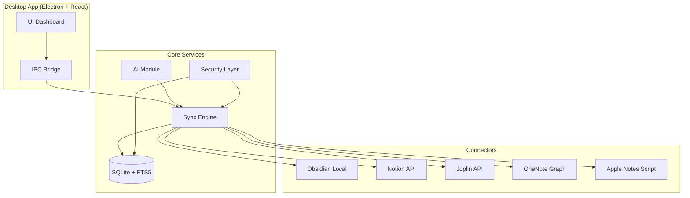
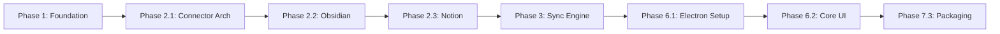
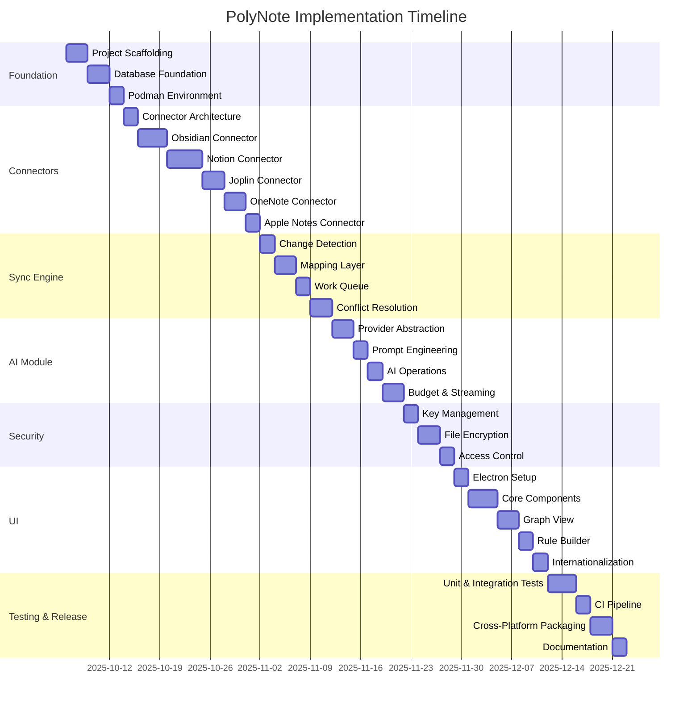

# PolyNote v1.0 - Comprehensive Implementation Plan

**Document Version**: 1.0  
**Date**: 2025-10-04  
**Target Completion**: 14 weeks (3.5 months)  
**Estimated Effort**: 180+ micro-tasks across 7 phases

---

## Table of Contents

1. [Executive Summary](#executive-summary)
2. [Architecture Overview](#architecture-overview)
3. [Phase-by-Phase Breakdown](#phase-by-phase-breakdown)
4. [Implementation Order & Dependencies](#implementation-order--dependencies)
5. [Sprint Planning](#sprint-planning)
6. [Validation Checklist](#validation-checklist)
7. [Risk Mitigation](#risk-mitigation)

---

## Executive Summary

This implementation plan breaks down the PolyNote MVP into **7 major phases**, **42 sub-modules**, and **180+ atomic micro-tasks**. Each task is designed to be:

- **Atomic**: Completable in 1-4 hours by Claude Sonnet 4.5
- **Testable**: Clear acceptance criteria
- **Independent**: Minimal dependencies on incomplete work
- **Traceable**: Maps directly to PRD requirements and project rules

### Key Metrics
- **Total Duration**: 14 weeks (3.5 months)
- **Target Code Coverage**: ≥80%
- **Platforms**: Linux, macOS (Intel + Apple Silicon), Windows
- **Connectors**: 5 (Obsidian, Notion, Joplin, OneNote, Apple Notes)
- **AI Providers**: 5 (Ollama, GPT4All, llama.cpp, OpenAI, Claude)

### Success Criteria (from [PRD.md](PRD.md:71-78))
- ✅ Obsidian → Notion sync within 60s
- ✅ Bidirectional sync with conflict resolution UI
- ✅ AI summarize 2000-word note in ≤30s (M2 16GB, 7B model)
- ✅ EN↔TE/HI translation support
- ✅ Cross-platform installers (DMG/PKG, EXE/NSIS, AppImage/DEB/RPM)

---

## Architecture Overview



### Technology Stack (from [PRD.md](PRD.md:6-11))

| Component | Technology |
|-----------|------------|
| **Backend** | TypeScript (Node.js/Express), Python (FastAPI) |
| **Frontend** | Electron + React, TailwindCSS |
| **Database** | SQLite with FTS5 |
| **Search** | SQLite FTS5; optional Meilisearch |
| **Encryption** | libsodium/sodium-native, OpenPGP.js |
| **AI** | Ollama, GPT4All, llama.cpp, OpenAI, Claude |
| **Containers** | Podman (dev + CI + release) |
| **CI/CD** | GitHub Actions |
| **Packaging** | electron-builder |

### Repository Structure (from [PRD.md](PRD.md:17))

```
polynote/
├── apps/
│   ├── desktop/          # Electron + React app
│   └── server/           # Node.js/Express API
├── packages/
│   ├── connectors/       # Connector implementations
│   │   ├── obsidian/
│   │   ├── notion/
│   │   ├── joplin/
│   │   ├── onenote/
│   │   └── apple-notes/
│   ├── ai/              # AI provider abstractions
│   └── shared/          # Common types, utils, DB
├── infra/               # Podman, CI configs
└── docs/                # Documentation
```

---

## Phase-by-Phase Breakdown

### Phase 1: Foundation & Infrastructure (Weeks 1-2)

See detailed breakdown in separate sections below.

### Phase 2: Core Connectors (Weeks 3-5)

See detailed breakdown in separate sections below.

### Phase 3: Sync Engine & Conflict Resolution (Weeks 6-7)

See detailed breakdown in separate sections below.

### Phase 4: AI Module (Weeks 8-9)

See detailed breakdown in separate sections below.

### Phase 5: Security & Encryption (Week 10)

See detailed breakdown in separate sections below.

### Phase 6: Desktop UI & UX (Weeks 11-12)

See detailed breakdown in separate sections below.

### Phase 7: Packaging, Testing & CI (Weeks 13-14)

See detailed breakdown in separate sections below.

---

## Implementation Order & Dependencies

### Critical Path (Sequential):


### Parallel Tracks:
- **Connectors**: Joplin (2.4), OneNote (2.5), Apple Notes (2.6) can be built in parallel after 2.1
- **AI Module** (Phase 4): Can develop independently once foundation ready
- **Security** (Phase 5): Can implement alongside connector work
- **Advanced UI** (Phase 6.3-6.5): Can add after basic UI works
- **Testing** (Phase 7.1-7.2): Continuous throughout, finalize at end



---

## Sprint Planning

### Sprint 1-2 (Weeks 1-2): Foundation
**Goal**: Establish development infrastructure

**Tasks**:
- Phase 1.1: Project scaffolding (monorepo, TypeScript, Git workflows)
- Phase 1.2: Database setup (SQLite + FTS5, migrations, search)
- Phase 1.3: Podman environment (Containerfile, compose, Makefile)

**Deliverables**:
- ✅ Runnable development environment
- ✅ Database with FTS5 search working
- ✅ `make dev-up` starts containers

### Sprint 3-4 (Weeks 3-4): Core Connectors Part 1
**Goal**: Implement connector architecture and first two connectors

**Tasks**:
- Phase 2.1: Connector architecture (IConnector, BaseConnector, registry)
- Phase 2.2: Obsidian connector (file watcher, parser, writer, mapper)
- Phase 2.3: Notion connector (OAuth, API wrapper, block mapper, delta sync)

**Deliverables**:
- ✅ Obsidian → DB sync working
- ✅ Notion OAuth flow complete
- ✅ Bidirectional Obsidian ↔ Notion sync

### Sprint 5-6 (Weeks 5-6): More Connectors + Sync Engine
**Goal**: Add remaining connectors and build sync engine

**Tasks**:
- Phase 2.4: Joplin connector
- Phase 3.1-3.2: Change detection + mapping layer
- Phase 3.3-3.4: Work queue + conflict resolution

**Deliverables**:
- ✅ 3 connectors operational
- ✅ Sync engine handles conflicts
- ✅ `.conflict.md` files created for manual resolution

### Sprint 7-8 (Weeks 7-8): OneNote, Apple Notes, AI Foundation
**Goal**: Complete connectors and start AI module

**Tasks**:
- Phase 2.5: OneNote connector (MS Graph, HTML→MD)
- Phase 2.6: Apple Notes connector (AppleScript)
- Phase 4.1-4.2: AI provider abstraction + prompt templates

**Deliverables**:
- ✅ All 5 connectors working
- ✅ AI providers registered (local + cloud)
- ✅ Secret redaction working

### Sprint 9-10 (Weeks 9-10): AI Operations + Security
**Goal**: Complete AI features and add security

**Tasks**:
- Phase 4.3-4.4: AI operations (summarize, translate, rewrite) + streaming
- Phase 5: Security (key management, encryption, access control)

**Deliverables**:
- ✅ AI summarize works locally
- ✅ EN↔TE↔HI translation
- ✅ Encrypted share bundles

### Sprint 11-12 (Weeks 11-12): Desktop UI
**Goal**: Build Electron app with React UI

**Tasks**:
- Phase 6.1: Electron setup (IPC bridge, security)
- Phase 6.2: Core components (NoteList, Editor, Search, SyncStatus)
- Phase 6.3: Graph view (vis-network)
- Phase 6.4: Rule builder
- Phase 6.5: Internationalization

**Deliverables**:
- ✅ Desktop app launches
- ✅ Notes editable with live preview
- ✅ Graph view renders
- ✅ UI in 3 languages (EN, TE, HI)

### Sprint 13-14 (Weeks 13-14): Testing, CI, Packaging, Documentation
**Goal**: Production-ready release

**Tasks**:
- Phase 7.1: Unit + integration + E2E tests (≥80% coverage)
- Phase 7.2: CI pipeline (GitHub Actions + Podman)
- Phase 7.3: Cross-platform packaging (electron-builder)
- Phase 7.4: Documentation (CONNECTORS.md, AI.md, SECURITY.md, CHANGELOG.md)

**Deliverables**:
- ✅ Test coverage ≥80%
- ✅ CI passing on Linux + macOS
- ✅ Installers for all platforms
- ✅ Documentation complete
- ✅ v1.0.0 release on GitHub

---

## Validation Checklist

### Acceptance Criteria (from [PRD.md Section 6](PRD.md:71-78))

- [ ] **Obsidian → Notion sync**: Create note in Obsidian → appears in Notion within 60s with title/body/tags preserved
- [ ] **Bidirectional sync**: Edit note in Notion → synced back to Obsidian; conflicts produce merge UI
- [ ] **Joplin with attachments**: Joplin note with image → imports into Notion with attachment intact
- [ ] **OneNote import**: OneNote page → readable in app; formatting normalized to Markdown
- [ ] **Apple Notes import**: Apple Notes read on macOS → available in PolyNote; provenance preserved
- [ ] **AI performance**: AI summarize on 2,000-word note finishes locally (≤M2 16GB) within 30s using a 7B model
- [ ] **Translation**: EN↔TE/HI translation available via local or cloud
- [ ] **Installers**: Installers generated for macOS/Windows/Linux using electron-builder in CI

### Additional Quality Gates

- [ ] **Code coverage**: ≥80% across all packages
- [ ] **Security**: No secrets in repo; gitleaks passes
- [ ] **Performance**: FTS5 search <100ms for 10k notes
- [ ] **Reliability**: Sync queue handles 100 concurrent operations
- [ ] **UI responsiveness**: Virtual scrolling renders 10k notes smoothly
- [ ] **Conflict resolution**: Manual merge UI works correctly
- [ ] **Encryption**: Share bundles decrypt with correct key
- [ ] **Rate limits**: Notion connector respects 3 req/sec limit
- [ ] **Cross-platform**: App runs on Linux, macOS (Intel + ARM), Windows

---

## Risk Mitigation

### From [PRD.md Section 12](PRD.md:103-106)

#### Risk 1: Apple Notes Read-Only Limitation
**Risk**: Apple Notes lacks public API; only read access via AppleScript

**Mitigation**:
- Export-first workflow: User exports from Apple Notes, PolyNote imports
- Document manual export process in [CONNECTORS.md](CONNECTORS.md)
- Periodic polling (every N minutes) to detect changes
- Tag notes with `#apple-notes` for provenance tracking

**Implementation**:
- Micro-task: Create AppleScript export automation
- Micro-task: Build polling mechanism with configurable interval
- Micro-task: Write user guide for export workflow

#### Risk 2: OneNote HTML→MD Fidelity
**Risk**: OneNote uses proprietary HTML; conversion may lose formatting

**Mitigation**:
- Use Pandoc + custom conversion rules as primary converter
- Use `turndown` library as fallback
- Store original HTML as attachment for reference
- Normalize unsupported elements to closest MD equivalent

**Implementation**:
- Micro-task: Implement [htmlToMarkdown()](packages/connectors/onenote/converter.ts:10) with Pandoc
- Micro-task: Custom turndown rules for OneNote-specific HTML
- Micro-task: Attachment handler for original HTML

#### Risk 3: Large Workspace Performance
**Risk**: Syncing 10k+ notes may be slow or cause timeouts

**Mitigation**:
- Chunked sync: Process 100 notes per batch
- Exponential backoff on API errors
- Resumable exports: Store cursor per connector
- Background sync: Don't block UI

**Implementation**:
- Micro-task: Pagination in [pullChanges()](packages/connectors/notion/sync.ts:10)
- Micro-task: Cursor persistence in SQLite
- Micro-task: Backoff logic in [BaseConnector.retry()](packages/connectors/base/BaseConnector.ts:15)

#### Risk 4: API Rate Limits
**Risk**: Notion (3 req/sec), MS Graph (variable) may throttle

**Mitigation**:
- Rate limiter per connector
- Queue requests when limit reached
- Automatic retry with backoff on 429 responses
- User notification when throttled

**Implementation**:
- Micro-task: [RateLimiter](packages/shared/src/RateLimiter.ts) class
- Micro-task: Integrate with [NotionClient](packages/connectors/notion/client.ts:1)
- Micro-task: UI notification component for rate limit status

#### Risk 5: Encryption Key Loss
**Risk**: Users may lose master passphrase, can't decrypt data

**Mitigation**:
- Key recovery via recovery phrase (BIP39 mnemonic)
- Backup master key to secure location (optional)
- Warn users prominently about key loss consequences
- Export unencrypted backup option

**Implementation**:
- Micro-task: Generate BIP39 recovery phrase
- Micro-task: Key recovery flow in UI
- Micro-task: Warning dialog on first encryption

#### Risk 6: Podman Availability
**Risk**: Podman not available on all systems (e.g., Windows CI)

**Mitigation**:
- Fallback to Docker on Windows
- Document Podman installation for all platforms
- Provide non-containerized development option
- CI uses matrix: Podman (Linux/macOS), Docker (Windows)

**Implementation**:
- Micro-task: Detect container runtime in CI scripts
- Micro-task: Update documentation with installation guides
- Micro-task: Add fallback in [Makefile](Makefile)

---

## Next Steps

### Immediate Actions (Week 1, Day 1)

1. **Repository Setup**:
   ```bash
   mkdir polynote && cd polynote
   git init
   git checkout -b develop
   pnpm init
   ```

2. **Create Workspace Structure**:
   ```bash
   mkdir -p apps/{desktop,server} packages/{connectors,ai,shared} infra docs
   ```

3. **Install Dev Dependencies**:
   ```bash
   pnpm add -D typescript @types/node eslint prettier
   pnpm add -D @commitlint/cli @commitlint/config-conventional
   ```

4. **Configure Git Hooks**:
   ```bash
   npx husky install
   npx husky add .husky/commit-msg 'npx --no-install commitlint --edit "$1"'
   ```

5. **Start First Micro-Task**:
   - Phase 1.1, Task 1: Initialize monorepo with pnpm workspaces
   - Expected completion: 1 hour
   - Acceptance: `pnpm install` works

### How to Use This Plan

1. **For Claude Sonnet 4.5**:
   - Follow micro-tasks sequentially within each phase
   - Each task has clear acceptance criteria
   - Use clickable file links for navigation (e.g., [schema.sql](packages/shared/src/db/schema.sql:1))
   - Track progress using checkboxes

2. **For Project Managers**:
   - Use sprint breakdown for timeline planning
   - Monitor validation checklist for quality gates
   - Reference risk mitigation for contingency planning

3. **For Developers**:
   - Pick tasks from current sprint
   - Follow code examples and implementation hints
   - Run tests after each micro-task
   - Commit using Conventional Commits format

---

## Appendix: Tool Commands

### Development Commands
```bash
# Start dev environment
make dev-up

# Run tests
pnpm test

# Run tests in container
podman run --rm -v $PWD:/repo -w /repo node:22-alpine npm test

# Lint code
pnpm lint

# Type check
pnpm type-check
```

### Database Commands
```bash
# Run migrations
pnpm --filter @polynote/shared run migrate

# Seed test data
pnpm --filter @polynote/shared run seed

# FTS5 reindex
sqlite3 ~/.polynote/notes.db "DELETE FROM NoteSearch; INSERT INTO NoteSearch SELECT * FROM Note;"
```

### AI Commands
```bash
# Start Ollama (local AI)
podman run -d -p 11434:11434 --name ollama ollama/ollama

# Pull model
ollama pull llama2:7b

# Test AI operation
curl -X POST http://localhost:3000/api/ai/summarize \
  -H "Content-Type: application/json" \
  -d '{"noteId": "123", "provider": "ollama"}'
```

### Packaging Commands
```bash
# Build for current platform
pnpm --filter @polynote/desktop run build

# Build all platforms (in CI)
podman run --rm -v $PWD:/project -w /project \
  ghcr.io/electron-userland/electron-builder:latest \
  --mac --win --linux

# Sign macOS build
export CSC_LINK=/path/to/cert.p12
export CSC_KEY_PASSWORD=password
pnpm --filter @polynote/desktop run build:mac
```

---

## Document Change Log

| Version | Date | Author | Changes |
|---------|------|--------|---------|
| 1.0 | 2025-10-04 | Claude Sonnet 4.5 | Initial comprehensive implementation plan created |

---

**End of Implementation Plan**

For questions or clarification on any micro-task, refer to:
- [PRD.md](PRD.md) for requirements
- [project-rules.md](project-rules.md) for team conventions
- [user-rules.md](user-rules.md) for user guidelines
- Individual task markdown files (e.g., [connector-notion.md](connector-notion.md))