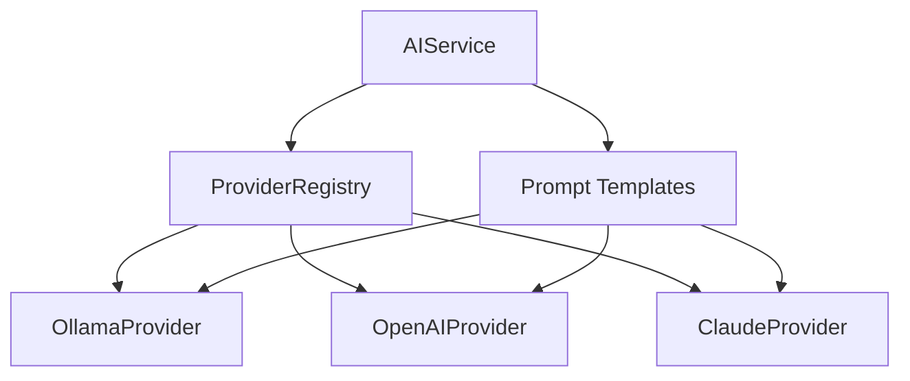

# AI Module Documentation

## Overview

The PolyNote AI module provides a unified interface for interacting with multiple AI providers (both local and cloud-based) for natural language processing tasks on notes. It implements a local-first policy with automatic cloud fallback, token budget tracking, and comprehensive secret redaction.

## Architecture



## Supported Providers

### Local Providers
- **Ollama**: Run models locally with full privacy
  - Models: llama2, llama3, mistral, codellama, etc.
  - Endpoint: `http://localhost:11434`

- **GPT4All**: Lightweight local models (Coming soon)
  - Models: Various 3B-7B models

- **llama.cpp**: Native C++ inference (Coming soon)
  - Ultra-fast local inference

### Cloud Providers
- **OpenAI**: GPT-3.5, GPT-4, GPT-4 Turbo
  - API: `https://api.openai.com/v1`
  - Requires: `OPENAI_API_KEY`

- **Claude**: Claude 3 (Haiku, Sonnet, Opus)
  - API: `https://api.anthropic.com/v1`
  - Requires: `CLAUDE_API_KEY`

## Installation

```bash
cd packages/ai
pnpm install
pnpm build
```

## Usage

### Basic Setup

```typescript
import { ProviderRegistry, AIService, ProviderType } from '@polynote/ai';

// Create registry with local-first policy
const registry = new ProviderRegistry({
  preferLocal: true,       // Try local providers first
  cloudFallback: true,     // Fall back to cloud if local fails
  maxRetries: 3,           // Retry failed requests
  timeoutMs: 30000,        // 30 second timeout
  tokenBudget: {
    daily: 100000,         // Daily token limit
    perRequest: 4096,      // Per-request token limit
  },
});

// Register Ollama (local)
await registry.registerProvider({
  type: ProviderType.OLLAMA,
  name: 'ollama-llama2',
  baseUrl: 'http://localhost:11434',
  model: 'llama2:7b',
  temperature: 0.7,
  maxTokens: 2048,
});

// Register OpenAI (cloud fallback)
await registry.registerProvider({
  type: ProviderType.OPENAI,
  name: 'openai-gpt4',
  baseUrl: 'https://api.openai.com/v1',
  apiKey: process.env.OPENAI_API_KEY,
  model: 'gpt-4',
  temperature: 0.7,
  maxTokens: 2048,
});

// Initialize registry
await registry.initialize();

// Create AI service
const aiService = new AIService(registry);
```

### Summarization

```typescript
// Basic summarization
const summary = await aiService.summarize(
  'This is a long document about machine learning and artificial intelligence...'
);
console.log(summary.content);

// With custom instructions
const summary = await aiService.summarize(
  longText,
  {
    customInstructions: 'Create a bullet-point summary focusing on key takeaways',
    provider: 'ollama-llama2', // Use specific provider
  }
);

// With streaming
const summary = await aiService.summarize(
  longText,
  { stream: true },
  (chunk) => {
    process.stdout.write(chunk); // Stream to console
  }
);
```

### Translation

```typescript
import { Language } from '@polynote/ai';

// English to Telugu
const translation = await aiService.translate(
  'Hello, how are you today?',
  {
    sourceLanguage: Language.ENGLISH,
    targetLanguage: Language.TELUGU,
  }
);

// Auto-detect source language
const translation = await aiService.translate(
  'నమస్కారం',
  {
    targetLanguage: Language.HINDI,
  }
);

// Supported languages
// - Language.ENGLISH (en)
// - Language.TELUGU (te)
// - Language.HINDI (hi)
```

### Rewriting

```typescript
import { RewriteStyle } from '@polynote/ai';

// Make text more formal
const formal = await aiService.rewrite(
  "Hey, what's up? Wanna grab coffee?",
  { style: RewriteStyle.FORMAL }
);
// Output: "Greetings, how are you? Would you like to meet for coffee?"

// Make text more concise
const concise = await aiService.rewrite(
  "This is a very long and wordy sentence with lots of unnecessary details...",
  { style: RewriteStyle.CONCISE }
);

// Available styles:
// - RewriteStyle.FORMAL - Professional, business-appropriate
// - RewriteStyle.CASUAL - Conversational, informal
// - RewriteStyle.CONCISE - Brief and to-the-point
// - RewriteStyle.DETAILED - Expanded with more information
// - RewriteStyle.TECHNICAL - Precise technical terminology
// - RewriteStyle.SIMPLE - Easy to understand
```

### Token Budget Management

```typescript
// Check current budget
const budget = aiService.getTokenBudget();
console.log(`Used: ${budget.usedToday}/${budget.dailyLimit}`);
console.log(`Remaining: ${budget.remaining}`);
console.log(`Resets at: ${budget.resetsAt}`);

// Check if request fits budget
const canProceed = aiService.isWithinBudget(estimatedTokens);

// Estimate tokens
const tokens = await aiService.estimateTokens('Some text to analyze');

// Reset usage (for testing)
aiService.resetTokenUsage();

// Get usage history
const history = aiService.getTokenUsageHistory();
```

### Provider Health Monitoring

```typescript
// Check all providers
const healthStatus = await aiService.getProvidersHealth();
healthStatus.forEach(health => {
  console.log(`${health.provider}: ${health.available ? 'UP' : 'DOWN'}`);
  if (health.responseTime) {
    console.log(`  Response time: ${health.responseTime}ms`);
  }
  if (health.error) {
    console.log(`  Error: ${health.error}`);
  }
});

// Get best available provider
const provider = await registry.getBestProvider();
if (provider) {
  console.log(`Best provider: ${provider.name}`);
}
```

## Security Features

### Secret Redaction

All AI prompts automatically redact sensitive information before sending to providers:

```typescript
import { redactSecrets } from '@polynote/ai';

const text = `
My API key is sk_test_1234567890abcdefgh
Password: mysecretpassword
JWT: eyJhbGciOiJIUzI1NiIsInR5cCI6IkpXVCJ9.eyJzdWIiOiIxMjM0NTY3ODkwIn0.abc123
Email: user@example.com
Server: 192.168.1.100
`;

const safe = redactSecrets(text);
// All sensitive data replaced with [REDACTED]
```

**Redacted Patterns:**
- API keys (32+ character alphanumeric strings)
- AWS access keys (AKIA...)
- GitHub tokens (ghp_, gho_, ghu_, ghs_, ghr_)
- Bearer tokens
- Private keys (PEM format)
- JWT tokens
- Passwords (password:, passwd=, etc.)
- Email addresses
- Private IP addresses (10.x.x.x, 192.168.x.x, 127.x.x.x, 172.16-31.x.x)

### Token Budget Limits

Prevents excessive API usage:

```typescript
const registry = new ProviderRegistry({
  tokenBudget: {
    daily: 100000,        // Max tokens per day
    perRequest: 4096,     // Max tokens per request
  },
});
```

## Performance Guidelines

### Local AI Best Practices

1. **Model Selection**
   - 3B-7B models for general use (recommended for M2 16GB)
   - 13B+ models for high-quality output (requires 32GB+ RAM)
   - Quantized models (Q4, Q5) for faster inference

2. **Expected Performance** (M2 16GB, 7B model)
   - Summarize 2000 words: ~20-30s
   - Translate 500 words: ~15-25s
   - Rewrite 1000 words: ~20-30s

3. **Optimization**
   - Enable GPU acceleration (Ollama does this automatically)
   - Use quantized models for faster inference
   - Adjust `maxTokens` based on needs

### Cloud AI Best Practices

1. **Cost Management**
   - Set token budgets to prevent unexpected costs
   - Use local providers for bulk operations
   - Reserve cloud for complex tasks

2. **Rate Limiting**
   - Providers enforce rate limits (Notion: 3 req/sec, OpenAI: varies by tier)
   - Registry handles automatic retry with backoff
   - Monitor health status to avoid repeated failures

## Provider-Specific Configuration

### Ollama

```typescript
await registry.registerProvider({
  type: ProviderType.OLLAMA,
  name: 'ollama-local',
  baseUrl: 'http://localhost:11434',
  model: 'llama2:7b',
  temperature: 0.7,     // 0-1, higher = more creative
  maxTokens: 2048,      // Max response length
  options: {
    // Ollama-specific options
    num_ctx: 4096,      // Context window size
    num_predict: 2048,  // Max tokens to generate
  },
});
```

**Common Models:**
- `llama2:7b` - General purpose, good balance
- `llama2:13b` - Higher quality, slower
- `mistral:7b` - Fast, efficient
- `codellama:7b` - Code-focused

### OpenAI

```typescript
await registry.registerProvider({
  type: ProviderType.OPENAI,
  name: 'openai-cloud',
  baseUrl: 'https://api.openai.com/v1',
  apiKey: process.env.OPENAI_API_KEY,
  model: 'gpt-4',
  temperature: 0.7,
  maxTokens: 2048,
});
```

**Available Models:**
- `gpt-3.5-turbo` - Fast, cost-effective
- `gpt-4` - Highest quality
- `gpt-4-turbo` - Fast GPT-4 variant

### Claude

```typescript
await registry.registerProvider({
  type: ProviderType.CLAUDE,
  name: 'claude-cloud',
  baseUrl: 'https://api.anthropic.com/v1',
  apiKey: process.env.CLAUDE_API_KEY,
  model: 'claude-3-sonnet-20240229',
  temperature: 0.7,
  maxTokens: 2048,
});
```

**Available Models:**
- `claude-3-haiku-20240307` - Fast, lightweight
- `claude-3-sonnet-20240229` - Balanced
- `claude-3-opus-20240229` - Highest quality

## Troubleshooting

### Ollama Not Available

```bash
# Check if Ollama is running
curl http://localhost:11434/api/tags

# Start Ollama with Docker/Podman
podman run -d -p 11434:11434 --name ollama ollama/ollama

# Pull a model
ollama pull llama2:7b
```

### API Key Issues

```bash
# Set environment variables
export OPENAI_API_KEY="sk-..."
export CLAUDE_API_KEY="sk-ant-..."

# Or use .env file
echo "OPENAI_API_KEY=sk-..." >> .env
echo "CLAUDE_API_KEY=sk-ant-..." >> .env
```

### Rate Limit Errors

```typescript
// Increase timeout and retries
const registry = new ProviderRegistry({
  maxRetries: 5,
  timeoutMs: 60000, // 60 seconds
});
```

### Out of Budget

```typescript
// Increase daily limit
const registry = new ProviderRegistry({
  tokenBudget: {
    daily: 500000, // Increase limit
    perRequest: 8192,
  },
});

// Or reset usage for testing
aiService.resetTokenUsage();
```

## Testing

```bash
# Run unit tests
cd packages/ai
pnpm test

# Run with coverage
pnpm test:coverage

# Watch mode
pnpm test:watch
```

## Examples

See [packages/ai/README.md](../packages/ai/README.md) for additional examples.

## API Reference

### Types

- `ProviderType` - Enum of supported providers
- `ProviderLocation` - LOCAL or CLOUD
- `OperationType` - SUMMARIZE, TRANSLATE, REWRITE, CHAT
- `Language` - ENGLISH, TELUGU, HINDI
- `RewriteStyle` - FORMAL, CASUAL, CONCISE, DETAILED, TECHNICAL, SIMPLE
- `AIRequest` - Request structure
- `AIResponse` - Response structure
- `TokenBudget` - Budget tracking
- `ProviderHealth` - Health status

### Classes

- `ProviderRegistry` - Manages providers with policy
- `AIService` - High-level AI operations
- `OllamaProvider` - Ollama implementation
- `OpenAIProvider` - OpenAI implementation
- `ClaudeProvider` - Claude implementation
- `BaseProvider` - Abstract base class

### Functions

- `redactSecrets(text)` - Redact sensitive information
- `getPromptForOperation(operation, content, params)` - Generate prompts

---

**Version**: 1.0.0
**Last Updated**: 2025-10-04
**Status**: Phase 4 Complete ✅
